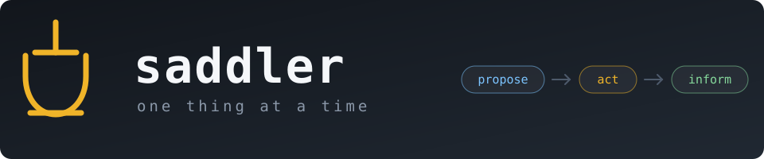

  

# Saddler: Per-Project Harness Setup Wizard

To install: `bash install.sh`
To invoke: run claude code in project folder; in claude code, type `/saddler`

# Design

A rough model of producitivity is `PRODUCTIVITY ∝ #TASKS / (#TURNS * AVERAGE TURN TIME)`

This is a wrong model considering task difficulty or a task may set user backwards towards overall goal. 

But here we assume it is true, since the agent is here to complete user tasks.  

We also assume human can capture agent errors instantly. 

## Minimize Redundant Turns

Count a turn as redundant if the agent does something user doesn't expect. 

Mitigation:
- Setup a feedback loop: build good enough unit tests
- Let the agent present a code skeleton: user know what will happen before it does
- Each term process one issue, so agent does not mix multiple jobs

## Minimize Average Turn Time

User must process agent's feedback. That takes time. 

Mitigation:
- Delay elaboration: less information, more turns, less than human time
- Make edits visible: user knows it immediately when things indeed go wrong
- Essential presets: so user doesn't have to enter them each time

## User Obligation

Agent's intelligence dilutes with context length. User must know that.  
